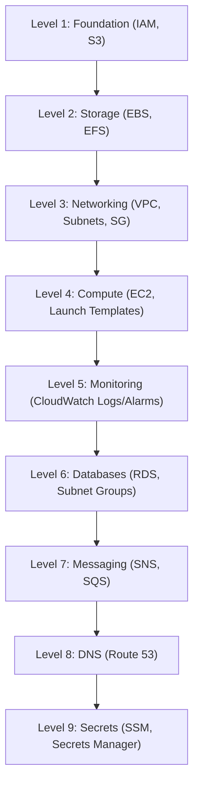

# 🌐 ZERO-TO-INFRA

Welcome to the **ZERO-TO-INFRA** repository, your complete step-by-step masterclass for mastering **Infrastructure as Code (IaC)** using **Terraform**.

This repository is carefully structured to take you from an absolute beginner to an advanced cloud engineer. It contains comprehensive conceptual documentation, practical hands-on lessons, real-world examples, and isolated environments to build, test, and manage cloud infrastructure reliably.

---

## 🗺️ Repository Structure

A quick guide to how the learning material is structured across files and folders:

```text
ZERO-TO-INFRA/
├── docs/                       # 📖 Conceptual Documentation (The Reading Corner)
│   ├── fundamentals/           # Detailed syntax, structures, and CLI concepts
│   └── 00-iac-introduction.md  # Foundational IaC introduction
│
├── 01-hcl-fundamentals/        # 🛠️ Practice basic Terraform configurations
├── 02-providers/               # 🛠️ Provider configs, version pinning & structures
├── 03-resources/               # 🛠️ Handling resource blocks, registry docs & attributes
│   ├── examples/               # S3 bucket, IAM user/group/policies configurations
│   └── resources-roadmap/      # AWS learning roadmap levels
│
├── 04-variables/               # ⏳ Planned: Dynamic configuration templates
├── 05-expressions/             # ⏳ Planned: Operators, conditionals & loops
├── 06-state-management/        # ⏳ Planned: State file, locking & operations
├── 07-modules/                 # ⏳ Planned: Reusable architecture blueprints
├── 08-backends/                # ⏳ Planned: Remote state, S3/DynamoDB locks
├── 09-workspaces/              # ⏳ Planned: Scaling workspaces & CLI flow
├── 10-advanced/                # ⏳ Planned: Dynamic blocks, import, functions
│
├── environments/               # 🌐 Multiple Environments (dev/ & prod/ layouts)
├── labs/                       # 🧪 Focused workspace labs (01-provider, 02-resources, etc.)
└── README.md                   # 🏠 You are here!
```

---

## 📂 Folder Breakdown: What & Why

Here is a comprehensive breakdown of why each directory exists and what role it plays in your learning journey.

| Folder | What is in it? | Why is it here? |
| :--- | :--- | :--- |
| 📖 [docs/](docs) | Markdown guides (HCL syntax rules, variables precedence, data structures, built-in functions). | To build your theoretical foundation before writing config code. |
| 🛠️ [01-hcl-fundamentals/](01-hcl-fundamentals) | Hands-on code files practicing basic resource blocks, variables, and output setups. | To get comfortable launching simple infrastructure and running CLI commands. |
| 🛠️ [02-providers/](02-providers) | Code demonstrating multi-file design layouts, version pinning, lock files, and multi-providers. | To learn production best practices: avoiding hardcoding, pinning constraints, and hybrid setups (AWS + Docker). |
| 🛠️ [03-resources/](03-resources) | Hands-on guides and templates for S3, IAM Users, Groups, Policies, and memberships. | To master official Terraform registry searching, input configurations, and exported attribute referencing. |
| ⏳ [04-variables/](04-variables) to [10-advanced/](10-advanced) | Planned slot folders for expressions, remote backends, modules, state tracking, and workspace CLI flow. | Outlines the advanced curriculum roadmap to scale configurations cleanly. |
| 🌐 [environments/](environments) | Directory-isolated infrastructure blocks for Development (`dev/`) and Production (`prod/`). | To practice environment isolation, parameter overrides, and prevent dev/prod drift. |
| 🧪 [labs/](labs) | Simple scratch sandbox testing environments (`01-provider`, `02-resources`, `03-variables`). | A throwaway workspace to test specific resource constraints without cluttering lessons. |

---

## 📖 1. The Reading Corner (Conceptual Docs)

All core theory, HCL syntax definitions, and engine mechanisms are organized in the [docs/](docs/README.md) directory.

| Guide | Description | Key Topics |
| :--- | :--- | :--- |
| 🚀 [00-IaC Introduction](docs/00-iac-introduction.md) | The "Why" of Infrastructure as Code | Manual issues, automated speed, provider registries. |
| 🧱 [01-Syntax Basics](docs/fundamentals/01-syntax-basics.md) | Understanding HCL Syntax | Blocks, arguments, labels, values, comments. |
| 📊 [02-Data Types](docs/fundamentals/02-data-types.md) | Data structure representation | Primitive types, collections (list, map), structural objects. |
| 🔄 [03-Variables](docs/fundamentals/03-variables.md) | Parameterizing configurations | Reusability, variable declarations, input precedence order. |
| ⚙️ [04-Built-in Functions](docs/fundamentals/04-built-in-functions.md) | Programmatic data transformations | String manipulation, collection mapping (`join`, `upper`, etc.). |
| 🧭 [05-Terraform Core](docs/fundamentals/05-Terraform-core.md) | The engine mechanics | Providers, Resources, Data Sources, and Modules. |
| 💡 [06-Important Concepts](docs/fundamentals/06-Some-Imp-Concept.md) | Deeper dive into Terraform blocks | Keyword case-sensitivity, initialization flow, internal settings. |

---

## 🛠️ 2. The Hands-on Lab (Practical Lessons)

Run these step-by-step folders in sequence to apply your knowledge:

### 📁 Lesson 1: [HCL Fundamentals](01-hcl-fundamentals/README.md)
*   **Concepts covered:** Defining providers/resources, declaring outputs, executing the base lifecycle commands (`init`, `plan`, `apply`, `destroy`).
*   **Examples:** Detailed version metadata walkthroughs inside [Eg_explanation.md](01-hcl-fundamentals/examples/Eg_explanation.md).

### 📁 Lesson 2: [Providers & Configuration Best Practices](02-providers/README.md)
*   **Concepts covered:** Avoiding hardcoding using input variables, structure patterns (split vs. single file compilation), version constraints, and `.terraform.lock.hcl`.
*   **Advanced:** Utilizing multiple providers simultaneously (e.g., AWS for remote production infrastructure + Docker for local testing).

### 📁 Lesson 3: [Resources Deep Dive](03-resources/README.md)
*   **Concepts covered:** Understanding declarative resources, searching the Terraform registry, parsing Required vs. Optional arguments, referencing Attribute exports, and formatting with `terraform fmt` and `terraform validate`.
*   **Examples:** Step-by-step deployment of an [AWS IAM User, Groups, Policies & Memberships](03-resources/examples/aws-iam-user.md).

### 📁 Lesson 4: [Managing Environments](environments/README.md)
*   **Concepts covered:** Structural patterns for segregating development (`dev/`) and production (`prod/`) configurations, directory layouts vs. workspaces, and environment-specific variable overrides.

---

## 🧪 3. Workspace Labs & Projects

For interactive testing and building, navigate to the focused lab workspaces:
*   🧪 [labs/01-provider/](labs/01-provider) — Quick workspace testing for provider mappings.
*   🧪 [labs/02-resources/](labs/02-resources) — Sandbox for provisioning resource dependencies.
*   🧪 [labs/03-variables/](labs/03-variables) — Sandbox for exercising input overrides.

---

## 🗺️ 4. AWS Resources Learning Roadmap

A progressive roadmap of AWS resources to build using Terraform, starting from basics to fully secure production environments. (Detailed roadmap available in [Roadmap.md](03-resources/resources-roadmap/Roadmap.md)).



---

## 🚀 5. The Professional Terraform Workflow

When deploying any cloud resource, follow these **8 professional engineering steps**:

```text
   1. UNDERSTAND           2. LOCATE            3. READ DOCS            4. PLAN
  Clear requirements   ➔   Registry resource  ➔  Inputs & Attributes ➔  Variables & outputs
                                                                            │
   8. IMPROVE              7. VERIFY            6. TEST & APPLY         5. CODE
  Refactor & clean     ➔   AWS Console check  ➔  fmt, validate, plan ➔  Minimal working block
```

### 🛠️ Key CLI Commands
Use these commands in your workflow before committing code:
*   `terraform fmt` — Formats configuration files into standard, clean HCL style.
*   `terraform validate` — Checks syntax, logic, data types, and references.
*   `terraform plan` — Compares code against state and generates an execution plan preview.
*   `terraform apply` — Provisions real-world cloud resources.
*   `terraform destroy` — Tears down managed infrastructure safely.

---

## 💡 6. Key Conceptual Analogies

Here are a few quick takeaways to help you remember how Terraform thinks:

### 🔌 The Provider Analogy
> **You (English Speaker)** ➔ **Terraform Provider (The Translator)** ➔ **AWS (Different Language Speaker)**
>
> Terraform needs the provider plugin to translate your generic code declarations into vendor-specific API calls. Without downloading this plugin (via `terraform init`), Terraform cannot talk to your cloud.

### 🔒 The Dependency Lock File (`.terraform.lock.hcl`)
> Keeps provider versions synced across all developer environments. 
> Prevents the "It works on my machine but breaks in production" syndrome when new provider versions are released.

### 🧭 The Plan Mechanism
> `terraform plan` under the hood: 
> **Read code** ➔ **Read state file** ➔ **Compare Code vs. State** ➔ **Output diffs**.

---

## 🚀 Getting Started

1.  Install the **Terraform CLI** (version `1.8+` recommended).
2.  Clone this repository.
3.  Read [docs/README.md](docs/README.md) to build your conceptual knowledge.
4.  Navigate to [01-hcl-fundamentals/](01-hcl-fundamentals/) to write your first Terraform blocks!