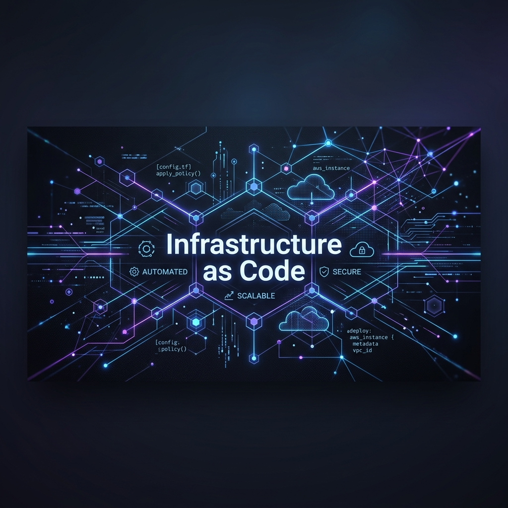
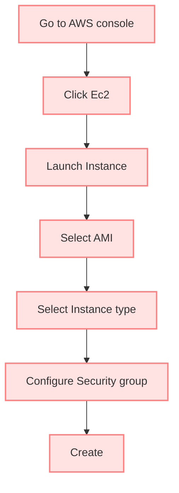

# 🌐 Understanding Infrastructure & IaC

Before Terraform, first understand what "Infrastructure means".

when you open a website like:
* Amazon
* Google
* Apple 

You only see the frontend of that website. 

Behind the scene there are: 

| Behind the Scene Components |
| :--- |
| 🖥️ Server |
| 💾 Databases |
| ⚙️ Virtual Machines |
| 🌐 Networks |
| 📦 Storage |
| ⚖️ Load Balancer |
| 🗺️ DNS |

All these things are together called **"INFRASTRUCTURE"**

---

### Example: 

Suppose a company wants host a website. 
 
 They need:
  1. Ec2 Instances
  2. Security groups
  3. Storage (S3 buckets)
  4. VPC
  5. Load Balancer

---

## 🏗️ Traditional Infrastructure Management

Now let me tell you how traditional Infrastructure is managed:
 
For Example: 

you need to create a Ec2 Instances, so in traditional infra mangement all the things we done it manually. step-by-step. which takes lot's of time and there is a chance of human error while creating infra manually.

Now see here we creating manuallly:



And like we do same for all the services. But this is not an idle situation in large production system. this won't there

> [!CAUTION]
> ### Problems with manual Infrastructure is :
> 
> | # | Problem |
> | :-: | :--- |
> | 1 | ⏳ Time consuming |
> | 2 | ❌ Human Errors |
> | 3 | 📝 No Documentation |
> | 4 | 🔄 Difficult Recovery |
> | 5 | 🚫 No Version Control |

---

## 💻 Infrastructure as Code (IaC)

Now we get to Know about :
**INFRASTRUCTURE AS CODE (IaC)**

Instead of creating Infrastructure manually.
we can easily write a code. for a particular services that we need to make or create. 

### Example: 
```hcl
provider "aws" {
    region = "us-east-1"
}
```

 like this we can write code. If I explain this code. By-the-way this code is very simple it just showing which provider we are using to make an infrastructure and in which in region. Okay this will that in "us-east-1" we have to create a particular services.

Now you get to know. that IaC is very powerfull and usefull. we dont need to select it manually. we just create our infrastructure in just one click.

> [!IMPORTANT]
> ### <!-- What is IaC? --> What is IaC?
> Managing and provisioning the infrastructure using code instead of manual process. 
> 
> *->  Just remember this definition. <-*

---

## ❤️ Why Big Companies Loves IaC?

Now You all are thinking that why Big companies loves IaC?

| Reason | Details & Analogies (Your Notes) |
| :--- | :--- |
| 🔄 **1. Consistency** | <ul><li>If you compile Java code with Java 8 vs Java 17, you get different results.</li><li>Similarly, if you manually configure servers, you get **(Configuration drift)**- one server has patches, another doesn't.</li><li>So IaC ensures:- Every servers is built from the same **"source code"** (Terraform files), just like computing the same source code produces identical binaries.</li></ul> |
| 🤖 **2. Automation** | <ul><li>Instead of manually running `mvn clean install`</li><li>Using IaC :- It does same for infrastructure you can use `terraform apply` which trigger the entire pipeline. which do all the things in order.</li></ul> |
| 🔁 **3. Repeatability** | <ul><li>Like creating a docker image and running multiple containers.</li><li>You build an image once and run 100 containers from it. You don't rebuild the image for each container.</li><li>IaC does the same: you just have to write your infrastructure code once, and use workspaces or modules to deploy it on dev, staging, and prod with just different variable files.</li></ul> |
| 🌿 **4. Version Control** | <ul><li>when any bug appears in an app. developer use `git blame` to check that or find out who made the changes in the code and when.</li><li>IaC does the same :- It stores all the Terraform files in the git. and whenever there is any such situation likes bugs or server crashes. it runs `git log` and `git diff` to see exactly what happen, who make changes in code and when.</li></ul> |
| ⚡ **5. Fast Recovery** | <ul><li>If server deleted we can't do anyhting we just need to create another server manually</li><li>IaC does create it on step by running one command like- `terraform apply`</li></ul> |

---

## 🔌 Terraform Providers

> [!NOTE]
> ### <!-- What is terrafrom providers? --> What is Terraform Providers?
> provider is plugin that allows Terraform to communicate with a platform or services.

### Different types of providers:

| Provider Type | Details & Examples (Your Notes) |
| :--- | :--- |
| 🥇 **1. Official** | These Providers are maintained by HashiCorp (The company behind Terraform).<br>_Example:_ .AWS, .AzureRM, . Kubernetes |
| 🥈 **2. Partner** | These providers are maintained by Terraform technology partners rather than HashiCorp.<br>_Example:_ .MongoDB Atlas, .Datadog |
| 🥉 **3. Community** | These providers are maintained and developed by individual developers or the open-source community<br>_Example:_ open-source platform providers |

For Official provider, like AWS, we define it in code:
```hcl
provider "aws" {
    region = "ap-south-1"
}
```

---

> [!TIP]
> ### <!-- Easy Way to Remember --> Easy Way to Remember
> * **Official**  → Maintained by HashiCorp
> * **Partner**   → Maintained by a partner company
> * **Community** → Maintained by individual developers/community
