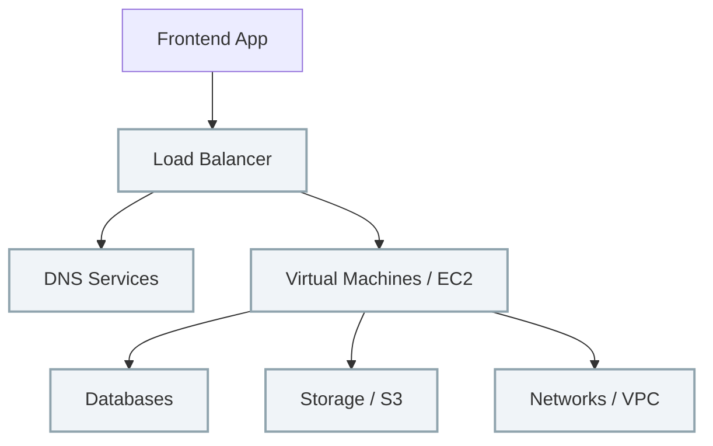
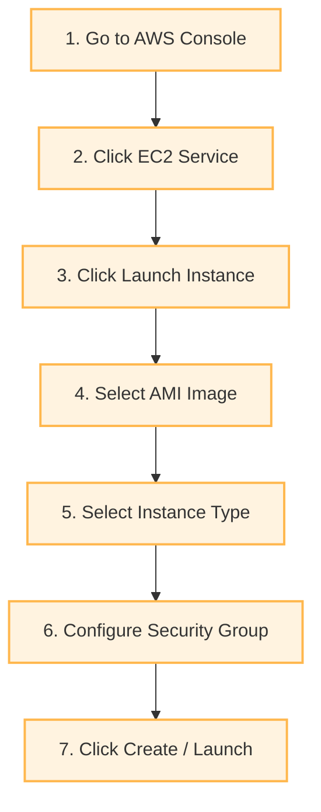

# 🌐 Understanding Infrastructure & IaC

Before diving into Terraform, it's crucial to understand what **Infrastructure** actually means and why modern software teams manage it using code.

---

## 🖥️ What is Infrastructure?

When you visit major websites like **Amazon**, **Google**, or **Apple**, you only see the **frontend** (the user interface). 

Behind the scenes, a massive network of components powers the application:



All of these background components collectively make up the **Infrastructure**.

### 📋 Real-World Example
If a company wants to host a web application, they typically need:
1. **EC2 Instances** (Servers to run code)
2. **Security Groups** (Firewalls to restrict access)
3. **S3 Buckets** (Object storage for files/media)
4. **VPC** (Virtual Private Cloud - network boundary)
5. **Load Balancers** (To distribute incoming traffic)

---

## 🏗️ Traditional Infrastructure Management

Traditionally, infrastructure was managed **manually** through web consoles (like the AWS Console), clicking through dashboards step-by-step.

### 🛑 The Manual Creation Workflow (Example: Launching an EC2 Instance)


While this works for simple testing, it becomes a major bottleneck for large-scale production environments.

> [!CAUTION]
> ### ⚠️ Problems with Manual Infrastructure
> * ⏳ **Time Consuming:** Recreating identical environments takes hours or days.
> * ❌ **Human Error:** It's easy to miss a checkbox or enter the wrong IP range.
> * 📝 **No Documentation:** The environment's configuration lives only in the console.
> * 🔄 **Difficult Disaster Recovery:** If a server crashes, rebuilding it requires starting from scratch.
> * 🚫 **No Version Control:** You cannot track who changed what configuration or when.

---

## 💻 Infrastructure as Code (IaC)

> [!IMPORTANT]
> **What is Infrastructure as Code (IaC)?**
> IaC is the practice of managing and provisioning infrastructure using **machine-readable definition files (code)** instead of manual interactive tools or hardware configurations.
> 
> *🔑 Remember this definition!*

Instead of clicking through consoles, you define your infrastructure in code files.

### 📝 Example: Declaring a Provider in Terraform (HCL)
```hcl
provider "aws" {
  region = "us-east-1"
}
```

* **How it works:** This simple block tells Terraform that we are using the **AWS** provider, and we want our infrastructure deployed in the **`us-east-1`** region.
* **The Power of IaC:** Instead of clicking 10 buttons, you run a single command (e.g., `terraform apply`), and Terraform builds the resources automatically in one click.

---

## ❤️ Why Big Companies Love IaC

Modern tech companies rely on IaC for five core reasons:

| Core Value | Analogy | How IaC Solves It |
| :--- | :--- | :--- |
| **1. Consistency** | **Java Compile:** Running Java 8 vs Java 17 yields different results. | **Prevents Configuration Drift:** Re-running the same code ensures every server is configured identically. |
| **2. Automation** | **Build Tools:** Running `mvn clean install` instead of compiling files manually. | **Pipelines:** Running `terraform apply` triggers automated infrastructure provisioning in the CI/CD pipeline. |
| **3. Repeatability** | **Docker Containers:** Building an image once and running 100 identical containers. | **Environments:** Write code once, then deploy to `dev`, `staging`, and `prod` using different variables/workspaces. |
| **4. Version Control** | **Git Blame:** Checking history to find who introduced a bug. | **Infrastructure Git History:** Terraform files are stored in Git. You can use `git log` and `git diff` to trace infrastructure history. |
| **5. Fast Recovery** | **Manual Setup:** Rebuilding a deleted server step-by-step from memory. | **One-Command Recovery:** If a server is deleted, running `terraform apply` spins up a new one instantly. |

---

## 🔌 Terraform Providers

> [!NOTE]
> A **Provider** is a plugin that allows Terraform to communicate with cloud platforms, SaaS services, or on-premise APIs.

Terraform has three main tiers of providers:

### 1. 🥇 Official Providers
* **Maintained by:** HashiCorp (the creators of Terraform).
* **Examples:** AWS, AzureRM, Google Cloud, Kubernetes.
```hcl
provider "aws" {
  region = "ap-south-1"
}
```

### 2. 🥈 Partner Providers
* **Maintained by:** Third-party technology partners (collaborating with HashiCorp).
* **Examples:** MongoDB Atlas, Datadog, Snowflake.

### 3. 🥉 Community Providers
* **Maintained by:** Individual developers or the open-source community.
* **Examples:** Custom integrations or niche platform APIs.

---

> [!TIP]
> ### 💡 Easy Way to Remember Providers
> * **Official:** Maintained by **HashiCorp**
> * **Partner:** Maintained by the **Partner Company**
> * **Community:** Maintained by **Open-source contributors**
